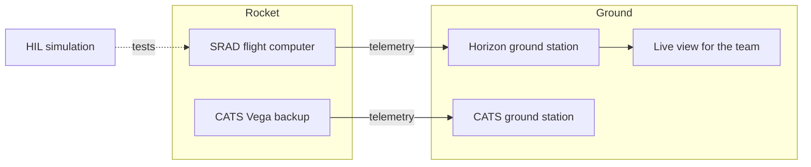

<picture>
  <source
    media="(prefers-color-scheme: dark)"
    srcset="https://raw.githubusercontent.com/USN-Horizon/.github/main/profile/assets/USNHorizonLogoLight.png">
  
</picture>

# Avionics

Flight computers, ground station, telemetry and simulation for USN Horizon's rockets.

The avionics team designs the electronics and software that fly inside the rocket, and the systems that follow it from the ground. For EuRoC 2027 that means our own flight computer, a ground station built into a rugged case, the telemetry link between them, and a hardware in the loop (HIL) setup that tests the flight software against simulated flights before it ever leaves the ground.

## What we build

| System | What it does |
| --- | --- |
| **Flight computer** | Our own SRAD flight computer. Reads the sensors, tracks the flight state, deploys recovery and sends telemetry. A CATS Vega flies alongside it as an independent backup with its own battery. |
| **Ground station** | A self contained station in a hard case. Receives telemetry, logs every flight and shows live data to the team at the launch site. |
| **Simulation** | Runs the flight software against simulated flights, so the code is tested long before it flies. |



## Repository structure

```text
Avionics/
├── hardware/
│   ├── flight-computer/    Flight computer PCB design
│   └── ground-station/     Ground station PCBs and case
├── software/
│   ├── flight-computer/    Flight firmware
│   ├── ground-station/     Telemetry receiver, logging and live view
│   └── simulation/         Hardware in the loop and flight simulation
├── docs/                   Presentations, onboarding, design reviews and notes
└── archived/               Earlier projects (2024 to 2026), kept for reference
```

Every folder has its own README explaining what belongs there.

## Tech stack

| Area | Tools |
| --- | --- |
| PCB design | Altium Designer and Altium 365 |
| Flight firmware | C++ on Zephyr RTOS |
| Ground station | Python, MCAP logging, Foxglove or Lichtblick for the live view |

## Contributing

Read [CONTRIBUTING.md](CONTRIBUTING.md) before your first pull request. All work happens on a branch and reaches `main` through a reviewed pull request.

## Links

[Horizon wiki](https://wiki.usnhorizon.no/) · [usnhorizon.no](https://usnhorizon.no/) · [avionics@usnhorizon.no](mailto:avionics@usnhorizon.no)
